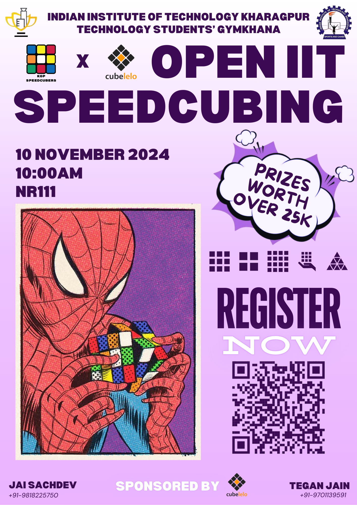
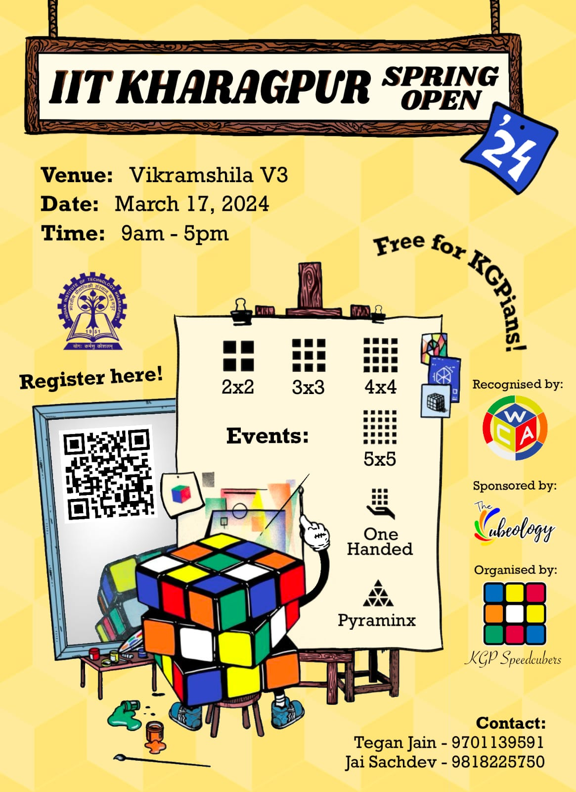
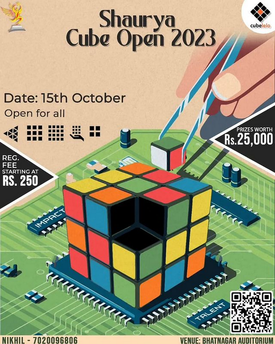

# How to Organise a Cubing Competition in IIT Kharagpur

## Table of Contents

**[Planning](#planning)**
1. [Details](#details)
1. [Budget](#budget)
1. [Sponsor](#sponsor)
    1. Cubelelo
    1. TheCubeology
1. [Equipment](#equipment)
    1. Posters
    1. Scorecards
    1. Certificates
    1. Timers and Mats
    1. Pens
1. [Publicity](#publicity)
    1. Posters
    1. Writeups

**[Competition Day](#competition_day)**


# Planning

## Details

First of all decide **when** the competition will happen. This will create a
mental timeline for you follow. Start Planning at least 2-4 weeks in advance. Hammer out all the important details
- [ ] Date
- [ ] Time
- [ ] Venue
- [ ] Events
- [ ] Competition Schedule
- [ ] Registrations: Unofficial events should be free for students, and at minimal
cost for official competitions.

## Budget

Create a proposed budget for important equipment such as

| Equipment | Quantity | Price
| --- | --- | ---
| Posters | 50 | 15*50 Rs
| Certificates | 15 | 30*15 Rs
| Room Booking | 1 | 4000Rs
| AV Cell | 1 | 2000 Rs

and so on

## Sponsor

Try to obtain a sponsor for your competition to provide credibility to the event
and have some kind of prizes to give to people. Cubelelo and TheCubeology have sponsored
our events in the past. 

### Cubelelo Sponsorship Process
Send a formal mail to [support@cubelelo.com](mailto:support@cubelelo.com) and [events@cubelelo.com](mailto:events@cubeleo.com) 
with a proposal `.pdf` for your event and what your deliverables. If Cubelelo accepts
they will send you a Memorandum of Understanding (MoU) explicitly mentioning all
deliverables and terms of the agreement.

### TheCubeology Sponsorship Process
Talk to Hitesh lol

## Equipment

There is a certain amount of necessary equipment that goes into conducting a competition.

- [ ] **Posters**: get posters printed and pasted in Halls and other common places 2-3
days before the comp
- [ ] **Scorecards**: Print all scorecards (around 1 per person per event). The current process used to make 
scorecards is that we have one blank scorecard template currently. I first convert
that to an image with `ffmpeg` or `ImageMagick` by
```
ffmpeg -i scorecards.pdf scorecard.png
```
this throws some errors that I haven't looked into but gets the job done. ImageMagick
is better suited for this though  
```
magick scorecards.pdf scorecards.png
```
Once I have the `.png` I open it up in `GIMP`, edit the name of the competition and 
convert it back to `.pdf` with 
```
img2pdf scorecard.png -o scorecard.pdf
```
- [ ] **Certificates and Medals**: if offerring certificates and medals get those printed
on time as well

Certificate Template Editing Links: <TBD>

- [ ] **Timers and Mats**: Make sure all timers and working and you have enough mats.
You may borrow large mousepads from friends if not sufficient.
- [ ] **Pens**: Make sure you have enough pens


## Publicity

Publicity is a crucial aspect of organising the event. For that certain things are required
1. A good poster
1. An announcement post on our socials
1. Constant Sharing

### Designing a Good Poster

Below are some of the posters we have used in the past

<div style="
  display: flex;
  justify-content: center;
  gap: 10px;
  align-items: center;
  flex-wrap: wrap;
">



</div>

---

There are some essential things to be included in the poster.
- [ ] Name of competition
- [ ] Date and Venue of the competition
- [ ] Events
- [ ] Registration Details
- [ ] Contact Details
- [ ] Logos: 
  1. Sponsor logo
  1. KGP Speedcubers logo
  1. If organising with TSG or any other entity their logos, usually in the top-left
  and top-right

A good poster can usually be made using a standard Canva template and an attractive 
cubing graphic from Pinterest. 

Poster Editing Links: <TBD>

### Announcement Post

To make an announcement you need to succintly summarise your main selling points
and use a lot of emojis. They should also contain as much of the essential information
as they can. Namely

- [ ] Quote
- [ ] Why Register (selling points)
- [ ] Date/Time/Venue
- [ ] Registration Links
- [ ] Contact

keeping it short is key

Examples: <TBD>

You will also need a 1:1 aspect version of your poster so plan accordingly. 

# Competition Day <a name="competition_day"/>
